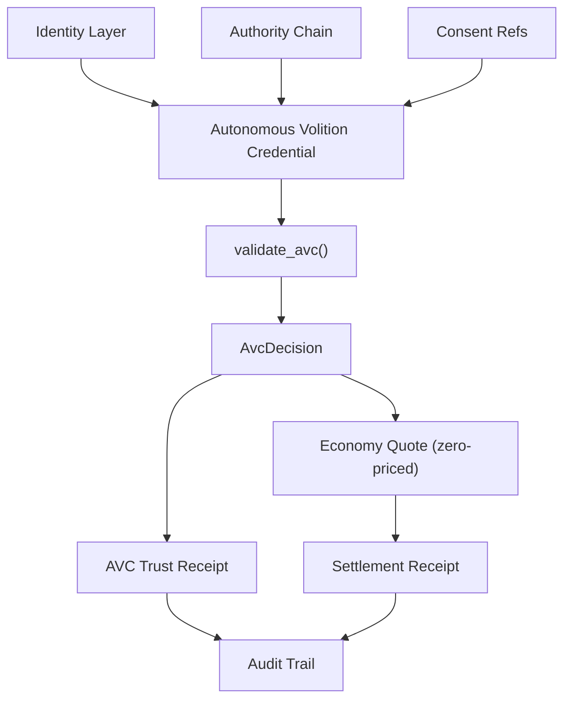

<!--
Copyright 2026 Exochain Foundation

Licensed under the Apache License, Version 2.0 (the "License");
you may not use this file except in compliance with the License.
You may obtain a copy of the License at:

    https://www.apache.org/licenses/LICENSE-2.0

Unless required by applicable law or agreed to in writing, software
distributed under the License is distributed on an "AS IS" BASIS,
WITHOUT WARRANTIES OR CONDITIONS OF ANY KIND, either express or implied.
See the License for the specific language governing permissions and
limitations under the License.

SPDX-License-Identifier: Apache-2.0
-->

# Autonomous Volition Credentials (AVC)

> **AVC** stands for **Autonomous Volition Credential** — a portable,
> signed, machine-verifiable credential that defines what an autonomous
> actor is authorized to **pursue, initiate, delegate, access, execute,
> and prove** under a human or organizational principal.

## Thesis

EXOCHAIN already has identity, authority, consent, governance, and
trust receipts. AVC is the missing object: a single inspectable
credential that answers *what is this autonomous actor allowed to
pursue?* before it acts.

| Primitive | What it proves |
|-----------|----------------|
| Identity | who the actor is |
| Authority | who delegated power |
| Consent | what data and action posture applies |
| **AVC** | **what autonomous intent is allowed before action** |

> **Important semantic constraint.** "Volition" here means **delegated
> operational intent**, not consciousness, sentience, emotion, or
> human-like free will. EXOCHAIN does not claim that autonomous actors
> have minds; it claims that operators must publish what their actors
> are allowed to pursue.

## Architecture



## Lifecycle

| Operation | Function | Domain tag |
|-----------|----------|------------|
| Issue | `issue_avc(draft, sign)` | `exo.avc.credential.v1` |
| LiveSafe public-output ceremony | `issue_livesafe_public_output_credential_ceremony(input, sign)` | `livesafe.public_output_credential_ceremony.v1` |
| Validate | `validate_avc(request, registry)` | (read-only) |
| Delegate | `delegate_avc(parent, child_draft, sign)` | `exo.avc.credential.v1` |
| Revoke | `revoke_avc(id, revoker, reason, now, sign)` | `exo.avc.revocation.v1` |
| Trust receipt | `create_trust_receipt(...)` | `exo.avc.receipt.v1` |
| LYNK usage receipt | `POST /api/v1/avc/llm-usage/receipts/emit` | `exo.avc.lynk.llm_usage.evidence.v1` |

Validation is **fail-closed**: missing keys, missing required consent
or policy refs, malformed structural values, scope violations,
expiration, and revocation each produce an explicit `AvcDecision::Deny`
result with sorted reason codes.

Delegation **strictly narrows** every dimension. A child credential
that widens permissions, tools, data classes, counterparties,
jurisdictions, autonomy level, budget, risk threshold, expiry, or
delegation depth is rejected with `AvcError::DelegationWidens`.

## Field reference

### `AutonomousVolitionCredential`

| Field | Type | Notes |
|-------|------|-------|
| `schema_version` | `u16` | Must equal `AVC_SCHEMA_VERSION` (`1`). |
| `issuer_did` | `Did` | DID that signs the credential. |
| `principal_did` | `Did` | Entity on whose behalf the actor operates. |
| `subject_did` | `Did` | The autonomous actor. |
| `holder_did` | `Option<Did>` | Defaults to `subject_did`. |
| `subject_kind` | `AvcSubjectKind` | AI agent, holon, workflow, etc. |
| `created_at` / `expires_at` | `Timestamp` | HLC timestamps. |
| `delegated_intent` | `DelegatedIntent` | Purpose, objectives, autonomy level, delegation flag. |
| `authority_scope` | `AuthorityScope` | Permissions, tools, data classes, counterparties, jurisdictions. |
| `constraints` | `AvcConstraints` | Budget, risk, approval threshold, time window, forbidden actions. |
| `authority_chain` | `Option<AuthorityChainRef>` | Required when `issuer_did != principal_did`. |
| `consent_refs` / `policy_refs` | `Vec<...>` | Required references must exist in the registry. |
| `parent_avc_id` | `Option<Hash256>` | Set on delegation. |
| `signature` | `Signature` | Issued by `issuer_did`. |

### `AvcValidationRequest`

| Field | Type | Notes |
|-------|------|-------|
| `credential` | `AutonomousVolitionCredential` | Already signed. |
| `action` | `Option<AvcActionRequest>` | Optional action being adjudicated. |
| `now` | `Timestamp` | Caller-provided "current time" — never read from the system clock. |

### `AvcValidationResult`

| Field | Type | Notes |
|-------|------|-------|
| `credential_id` | `Hash256` | Deterministic credential ID. |
| `decision` | `AvcDecision` | `Allow`, `Deny`, `HumanApprovalRequired`, `ChallengeRequired`. |
| `reason_codes` | `Vec<AvcReasonCode>` | Sorted, deduped. |
| `normalized_holder_did` | `Did` | Effective holder. |
| `valid_until` | `Option<Timestamp>` | Mirrors `expires_at`. |
| `receipt` | `Option<AvcTrustReceipt>` | Populated when the caller asks for one. |

## Determinism contract

- Canonical CBOR + BLAKE3 over a domain-tagged payload.
- All collections are normalized (sorted, deduped) **before** signing.
- No floating-point values, no `HashMap`/`HashSet`, no system-clock
  reads.
- Validation passes `now` in from the caller.

## Security model

- Signing domains are versioned and distinct (`exo.avc.credential.v1`,
  `exo.avc.receipt.v1`, `exo.avc.revocation.v1`) so wire payloads
  cannot be re-purposed across object types.
- Tampering with any signed field invalidates the signature.
- Authority chains are verified through `exo-authority`'s existing
  `verify_chain` API; the credential carries only the chain's hash so
  private chain content is not gossipped.
- Required consent and policy references must exist in the validator's
  registry before validation can `Allow`.
- Revocation always wins: the registry's `is_revoked` check is fatal
  even if every other field is valid.
- The MVP registry is in-memory; production deployments must back it
  with a durable, governance-controlled store.

## EXOCHAIN LYNK Protocol

LYNK binds supported LLM and MCP usage to AVC trust receipts. V1 covers OpenAI
Responses, OpenAI Chat Completions, and MCP `tools/call`. The trusted adapter
route is:

```text
POST /api/v1/avc/llm-usage/receipts/emit
```

The route verifies the adapter evidence signature, the subject action
signature, registered AVC authority, `Permission::Execute`, idempotency, receipt
chain position, timestamp/finality evidence, and the LYNK evidence hash before
storing a receipt. The generic external receipt-ingestion path remains
fail-closed.

Receipts are minimized by default. They carry hashes, counters, policy hashes,
safe metadata, and receipt/finality links. Raw provider or tool payloads,
provider secrets, bearer tokens, KMS material, raw object locations, and raw
signatures do not belong in receipt bodies. DAG DB custody is a separate
governed storage mode that requires explicit consent and policy evidence.

Human and AI coding agents should start with
[`packages/exochain-llm-proxy/README.md`](../../packages/exochain-llm-proxy/README.md)
and
[`packages/exochain-llm-proxy/AGENTS.md`](../../packages/exochain-llm-proxy/AGENTS.md).

## Example: a research-only AVC

```json
{
  "schema_version": 1,
  "issuer_did": "did:exo:issuer",
  "principal_did": "did:exo:issuer",
  "subject_did": "did:exo:agent-alpha",
  "holder_did": null,
  "subject_kind": {
    "AiAgent": {
      "model_id": "alpha",
      "agent_version": "1.0.0"
    }
  },
  "created_at": { "physical_ms": 1770000000000, "logical": 0 },
  "expires_at": { "physical_ms": 1770086400000, "logical": 0 },
  "delegated_intent": {
    "intent_id": "00...",
    "purpose": "Research approved counterparties and prepare recommendations",
    "allowed_objectives": ["draft_recommendation", "risk_summary", "vendor_research"],
    "prohibited_objectives": ["execute_payment", "share_personal_data", "sign_contract"],
    "autonomy_level": "Draft",
    "delegation_allowed": false
  },
  "authority_scope": {
    "permissions": ["Read"],
    "tools": ["crm.read", "vendor.search"],
    "data_classes": ["Internal", "Public"],
    "counterparties": [],
    "jurisdictions": ["US"]
  },
  "constraints": {
    "max_budget_minor_units": null,
    "currency_code": null,
    "max_action_risk_bp": 2000,
    "human_approval_required": false,
    "approval_threshold_bp": 5000,
    "max_delegation_depth": 0,
    "allowed_time_window": null,
    "forbidden_actions": ["contract.sign", "payment.execute"],
    "emergency_stop_refs": []
  },
  "authority_chain": null,
  "consent_refs": [],
  "policy_refs": [],
  "parent_avc_id": null,
  "signature": "..."
}
```

## Relationship to the economy layer

The economy layer is **strictly downstream** of AVC validation. AVC
validation **never** consults pricing or settlement state, and the
economy layer **never** uses payment status to gate trust. During the
launch phase, every quote and settlement resolves to zero — see
[../economy/README.md](../economy/README.md).

## Non-claims

- AVC does **not** assert that an autonomous actor is conscious,
  sentient, or has free will.
- The MVP is in-memory; persistence, federation, distributed revocation
  registries, JSON-LD VC alignment, and selective disclosure are
  follow-up work.
- AVC is not a full W3C VC implementation; it borrows the shape and the
  spirit, not the JSON-LD context.
