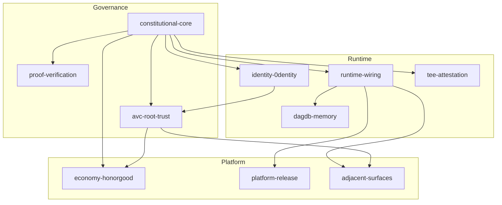

<!--
Copyright 2026 Exochain Foundation

Licensed under the Apache License, Version 2.0 (the "License");
you may not use this file except in compliance with the License.
You may obtain a copy of the License at:

    https://www.apache.org/licenses/LICENSE-2.0

Unless required by applicable law or agreed to in writing, software
distributed under the License is distributed on an "AS IS" BASIS,
WITHOUT WARRANTIES OR CONDITIONS OF ANY KIND, either express or implied.
See the License for the specific language governing permissions and
limitations under the License.

SPDX-License-Identifier: Apache-2.0
-->

# Mission Graph — Ecosystem of Ecosystems

Machine registry: [`mission-graph.yaml`](mission-graph.yaml).  
**Status is never authored here** — follow `gap_refs` and `progress_sources` into SSOTs.

## Nodes

| ID | Title | Drill-down |
|----|-------|------------|
| constitutional-core | Constitutional core | [nodes/constitutional-core.md](nodes/constitutional-core.md) |
| proof-verification | Proof and verification | [nodes/proof-verification.md](nodes/proof-verification.md) |
| runtime-wiring | Runtime wiring | [nodes/runtime-wiring.md](nodes/runtime-wiring.md) |
| identity-0dentity | Identity and 0dentity | [nodes/identity-0dentity.md](nodes/identity-0dentity.md) |
| avc-root-trust | AVC and root trust | [nodes/avc-root-trust.md](nodes/avc-root-trust.md) |
| dagdb-memory | DAG DB governed memory | [nodes/dagdb-memory.md](nodes/dagdb-memory.md) |
| tee-attestation | TEE and attestation | [nodes/tee-attestation.md](nodes/tee-attestation.md) |
| economy-honorgood | Economy and HonorGood | [nodes/economy-honorgood.md](nodes/economy-honorgood.md) |
| platform-release | Platform and release | [nodes/platform-release.md](nodes/platform-release.md) |
| adjacent-surfaces | Adjacent surfaces | [nodes/adjacent-surfaces.md](nodes/adjacent-surfaces.md) |
