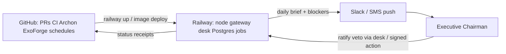

<!--
Copyright 2026 Exochain Foundation

Licensed under the Apache License, Version 2.0 (the "License");
you may not use this file except in compliance with the License.
You may obtain a copy of the License at:

    https://www.apache.org/licenses/LICENSE-2.0

Unless required by applicable law or agreed to in writing, software
distributed under the License is distributed on an "AS IS" BASIS,
WITHOUT WARRANTIES OR CONDITIONS OF ANY KIND, either express or implied.
See the License for the specific language governing permissions and
limitations under the License.

SPDX-License-Identifier: Apache-2.0
-->

# Mission C2 Runtime Topology

**Status:** Locked  
**Classification:** Governance / C2 steering — not a constitutional trust claim.

## Planes

| Plane | Home | What runs there |
|-------|------|-----------------|
| **Runtime / hosting** | **Railway** | EXOCHAIN node/gateway (`railway.json` / Dockerfile), adjacent services (LiveSafe, CommandBase Presidential Desk when deployed), Postgres, scheduled Daily Attention jobs, Slack/SMS notify adapters |
| **Orchestration / control** | **GitHub** | CI gates (`.github/workflows/ci.yml`), deploy promote (`livesafe-railway-deploy.yml` pattern), ExoForge triage (`exoforge-triage.yml`), Archon workflow triggers, scheduled daily brief workflow, PR merge as HOW change-control |
| **Source of truth (code)** | **GitHub repo** | Mission Graph docs, crates, workflows — Railway deploys from Git commits, never as a second control plane |

## Implications

- Daily Attention Orchestrator and blocker escalation run as **Railway-hosted** jobs/services, triggered or gated by **GitHub** (scheduled workflow and/or in-service cron after deploy).
- Secrets (Slack webhook, Twilio, LLM provider keys) live in **Railway env / GitHub Actions secrets** — not in repo; status routes fail closed if unset.
- Deploy evidence stays commit-SHA-bound.
- Extend the existing ARMORCLOUD/EXOCHAIN Railway project and GitHub workflow patterns; do not invent alternate hosting.

## Workflows

| Workflow | Role |
|----------|------|
| `.github/workflows/ci.yml` | Constitutional quality gates |
| `.github/workflows/livesafe-railway-deploy.yml` | Railway promote pattern to reuse |
| `.github/workflows/exoforge-triage.yml` | Agent triage trigger |
| `.github/workflows/presidential-daily-attention.yml` | Scheduled / manual C2 brief gate (fail-closed until configured) |
| `.archon/workflows/exochain-presidential-daily-attention.yaml` | Bounded Archon loop for brief assembly + Chairman escalate |

## Fail-closed

If Railway env, Slack/SMS secrets, or EXOCHAIN API base URL are missing, Presidential Desk and push adapters must not invent authority — they surface `unconfigured` and refuse binding ratify/veto display claims.
