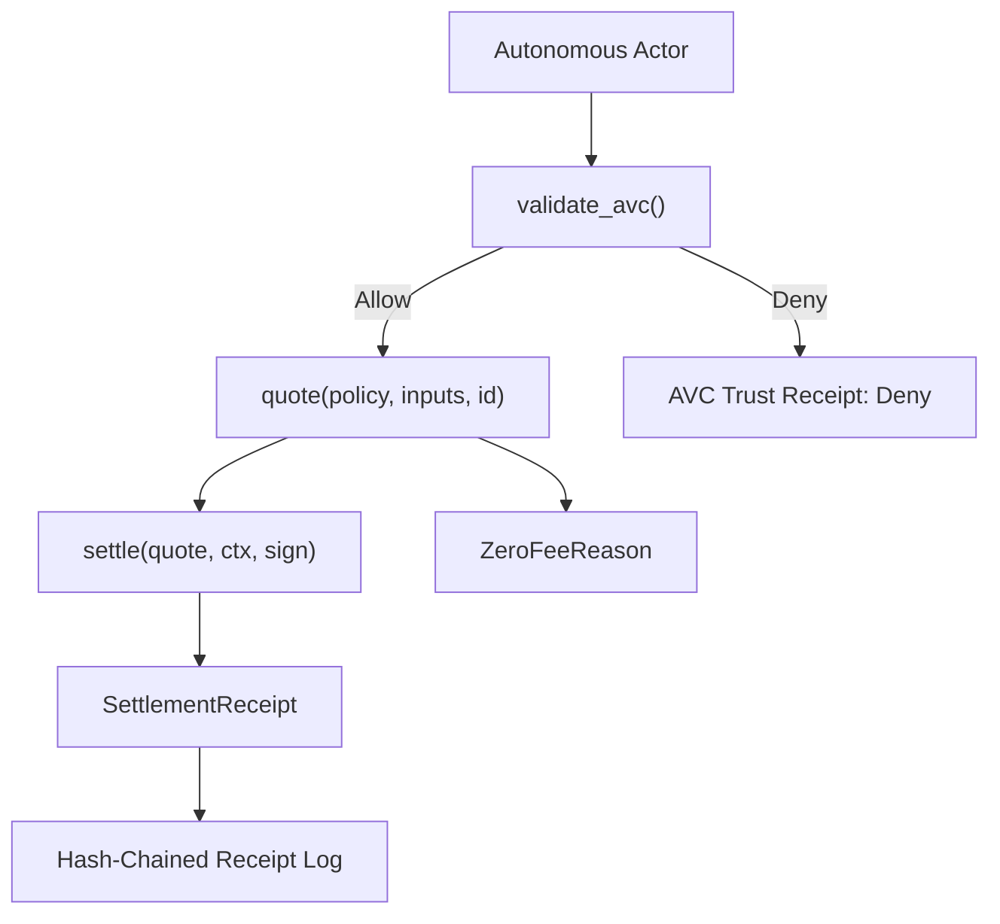

# EXOCHAIN Custody-Native Economy

> **EXOCHAIN is chain-of-custody for autonomous execution.** The economy
> layer prices economically-consequential autonomous activity. During
> the **launch phase, every active price resolves to zero** so trust is
> never paywalled. The full quote → settle → receipt mechanism still
> runs end-to-end, ready for governance to flip nonzero pricing on later
> without changing this surface.

## Zero-pricing guarantee (launch phase)

For every event class, every actor class, every assurance class, and
every input — including adversarial maxima — the launch policy returns:

- `charged_amount_micro_exo == 0`
- every field in `PriceBreakdown` is `0`
- every `RevenueShareLine.amount_micro_exo` is `0`
- a populated, explicit `ZeroFeeReason`

This is not a special case in `quote()`. It is the structural
consequence of [`PricingPolicy::zero_launch_default`]: every active
rate, multiplier, vigorish, share basis-point bonus, floor, and ceiling
is `0`, and the integer-only price formula clamps to the `[floor,
ceiling]` window.

> **AVC validation is independent of pricing.** AVC validity does not
> change with quote, settlement, or payment state. The two layers are
> wired through receipts (audit) — never through gating.

## Architecture



## Routes

| Method | Path | Purpose |
|--------|------|---------|
| `POST` | `/api/v1/economy/quote` | Build a `SettlementQuote` from `PricingInputs`. |
| `POST` | `/api/v1/economy/settle` | Settle a quote into a `SettlementReceipt`. |
| `GET`  | `/api/v1/economy/receipts/:id` | Fetch a stored settlement receipt. |
| `GET`  | `/api/v1/economy/policy/active` | Inspect the active `PricingPolicy`. |

POSTs inherit the node's bearer-auth write guard; reads are public.

## Field reference

### `PricingInputs`

| Field | Type | Notes |
|-------|------|-------|
| `actor_did` | `Did` | Actor DID. |
| `actor_class` | `ActorClass` | Human, AutonomousAgent, Holon, etc. |
| `event_class` | `EventClass` | AVC validate, custody anchor, holon commercial action, etc. |
| `assurance_class` | `AssuranceClass` | Free, Standard, Anchored, LegalGrade, Regulated, Critical. |
| `declared_value_micro_exo` / `realized_value_micro_exo` | `Option<MicroExo>` | Drives value/risk components when nonzero policy is active. |
| `compute_units` / `storage_bytes` / `verification_ops` | `u64` | Usage metering. |
| `network_load_bp` / `risk_bp` | `BasisPoints` | Bounded `0..=10_000`. |
| `market_domain` | `Option<String>` | Tenant or market namespace. |
| `timestamp` | `Timestamp` | HLC timestamp. |

### `SettlementQuote`

| Field | Type | Notes |
|-------|------|-------|
| `id` | `String` | Caller-supplied. |
| `policy_id` / `policy_version` | `String` | Provenance for the active policy. |
| `pricing_mode` | `PricingMode` | `Zero` during launch. |
| `zero_fee_reason` | `Option<ZeroFeeReason>` | Always present in launch phase. |
| `gross_amount_micro_exo` / `charged_amount_micro_exo` | `MicroExo` | Both `0` during launch. |
| `breakdown` | `PriceBreakdown` | All components `0` during launch. |
| `revenue_shares` | `Vec<RevenueShareLine>` | All amounts `0` during launch. |
| `issued_at` / `expires_at` | `Timestamp` | TTL-bounded. |
| `quote_hash` | `Hash256` | Deterministic content hash; non-zero. |

### `SettlementReceipt`

| Field | Type | Notes |
|-------|------|-------|
| `id` | `String` | Caller-supplied. |
| `quote_hash` | `Hash256` | Verified before settlement. |
| `actor_did` | `Did` | Carried from the quote. |
| `event_class` | `EventClass` | Carried from the quote. |
| `charged_amount_micro_exo` | `MicroExo` | `0` during launch. |
| `zero_fee_reason` | `Option<ZeroFeeReason>` | Carried from the quote. |
| `revenue_shares` | `Vec<RevenueShareLine>` | All amounts `0` during launch. |
| `custody_transaction_hash` | `Hash256` | Caller-provided link to the action. |
| `prev_settlement_receipt` | `Hash256` | Forms a per-store hash chain. |
| `timestamp` | `Timestamp` | HLC. |
| `content_hash` | `Hash256` | Deterministic over signed fields. |
| `signature` | `Signature` | Caller-supplied. |

### `ZeroFeeReason`

| Variant | Use |
|---------|-----|
| `HumanBaseline` | Human or human-sponsored agent on a non-special event. |
| `PublicGood` | `PublicGood` actor class. |
| `IdentityLookup` | Identity resolution / agent passport lookup. |
| `AgentValidation` | AVC validate. |
| `ConsentRevocation` | Consent revoke. |
| `PolicyConfiguredZero` | Default for any other zero in the launch phase. |
| `LaunchSubsidy`, `DeveloperPreview`, `Subsidized`, `FreeTier`, `InternalTest`, `GovernanceWaiver`, `HumanTrustBootstrap` | Documented future use. |

## Example: a zero-priced quote

```json
{
  "id": "q-1",
  "policy_id": "exo.economy.zero-launch",
  "policy_version": "v1",
  "actor_did": "did:exo:agent",
  "actor_class": "Holon",
  "event_class": "HolonCommercialAction",
  "assurance_class": "Standard",
  "pricing_mode": "Zero",
  "zero_fee_reason": "PolicyConfiguredZero",
  "gross_amount_micro_exo": "0",
  "discount_amount_micro_exo": "0",
  "subsidy_amount_micro_exo": "0",
  "charged_amount_micro_exo": "0",
  "breakdown": {
    "compute_component_micro_exo": "0",
    "storage_component_micro_exo": "0",
    "verification_component_micro_exo": "0",
    "value_component_micro_exo": "0",
    "risk_component_micro_exo": "0",
    "assurance_component_micro_exo": "0",
    "network_load_component_micro_exo": "0",
    "protocol_vig_micro_exo": "0",
    "gross_amount_micro_exo": "0",
    "charged_amount_micro_exo": "0"
  },
  "revenue_shares": [
    {
      "recipient": "ProtocolTreasury",
      "share_bp": 10000,
      "amount_micro_exo": "0"
    }
  ],
  "issued_at": { "physical_ms": 1000000, "logical": 0 },
  "expires_at": { "physical_ms": 1060000, "logical": 0 },
  "quote_hash": "..."
}
```

## Future activation

Switching the launch phase off is a **policy** change, not a code
change. A governance proposal can set:

- nonzero `compute_unit_price_micro_exo`, `storage_byte_price_micro_exo`,
  `verification_op_price_micro_exo`
- nonzero `protocol_vig_bp`, `value_share_bp`, `risk_share_bp`
- nonzero `global_ceiling_micro_exo`
- non-neutral actor / event / assurance multipliers
- richer revenue-share templates per event class

The deterministic formula in
[`compute_breakdown`](../../crates/exo-economy/src/price.rs) immediately
starts producing nonzero outputs. AVC validity, identity, consent,
authority, and governance behavior are unchanged.

## Determinism contract

- Integer-only (`MicroExo = u128`, `BasisPoints = u32`).
- Saturating arithmetic prevents overflow under adversarial inputs.
- All hashing is BLAKE3 over canonical CBOR with versioned domain tags
  (`exo.economy.quote.v1`, `exo.economy.settlement_receipt.v1`,
  `exo.economy.policy.v1`).
- Settlement receipts form a per-store hash chain via
  `prev_settlement_receipt`.
- No floats. No unordered collections. No system clock.

## Non-claims

- This MVP does not implement a token launch, fiat rails, external
  exchanges, or ML-driven pricing.
- The store is in-memory; persistence is a follow-up PR.
- Adaptive multipliers and revenue-share templates are present
  structurally but resolve to neutral / zero values during the launch
  phase.
