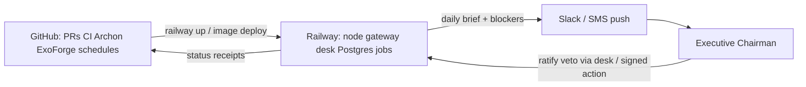
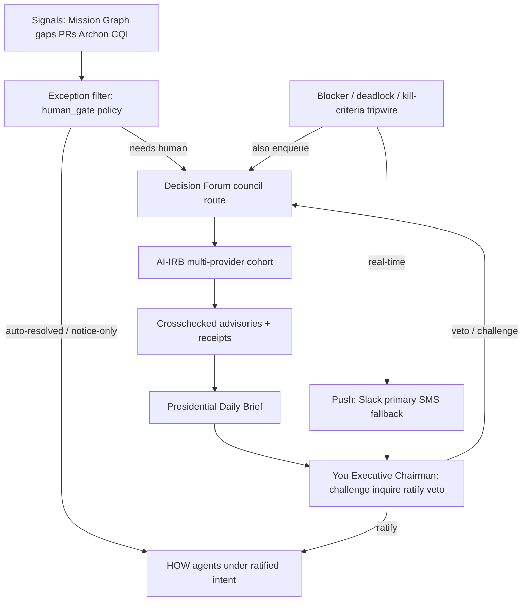

<!--
Copyright 2026 Exochain Foundation

Licensed under the Apache License, Version 2.0 (the "License");
you may not use this file except in compliance with the License.
You may obtain a copy of the License at:

    https://www.apache.org/licenses/LICENSE-2.0

Unless required by applicable law or agreed to in writing, software
distributed under the License is distributed on an "AS IS" BASIS,
WITHOUT WARRANTIES OR CONDITIONS OF ANY KIND, either express or implied.
See the License for the specific language governing permissions and
limitations under the License.

SPDX-License-Identifier: Apache-2.0
-->

# Presidential Mission C2 — Daily Attention + Mission Graph

**Status:** Planning / not implemented  
**Date:** 2026-07-12  
**Classification:** Governance / C2 steering plan (docs + future core adapter + adjacent Presidential Desk). Not a constitutional trust claim by itself.

**Overview:** Build a presidential-level C2 loop on Railway (runtime) orchestrated via GitHub (CI/CD, Archon/ExoForge triggers): Mission Graph + Daily Attention Orchestrator (council-routed AI-IRB, receipts, ratify/veto) + real-time Executive Chairman Slack/SMS escalation. Irreversible actions require dual attestation from Bob (`bob-stewart`) and Max (`mstewartbz`). Dogfood manual IRB slice before automating push.

## Workstream checklist

| ID | Work item | Status |
|----|-----------|--------|
| railway-github-topology | Lock runtime topology: Railway hosts services; GitHub Actions/workflows orchestrate build, deploy, Archon/ExoForge, and scheduled daily brief | pending |
| c2-doctrine | Add `docs/c2/` doctrine: WHY/HOW, presidential attention policy, SSOT rules, AI-IRB cohort roster | pending |
| c2-graph-yaml | Author `mission-graph.yaml` + `MISSION-GRAPH.md` (ecosystem Mermaid + workstream nodes) | pending |
| c2-node-pages | Create per-node drill-downs with intent, deps, SSOTs, and Steer Packs | pending |
| daily-orchestrator-spec | Specify Daily Attention Orchestrator: exception filter, council pre-route, brief schema, ratify/veto/challenge actions | pending |
| chairman-push-escalation | Specify real-time blocker escalation to Executive Chairman via Slack (primary) + SMS fallback; receipted notify path | pending |
| airb-cohort-wiring | Wire exo-consensus provider seats (xAI/OpenAI/Anthropic first) to decision-forum human_gate; D9-aligned receipts | pending |
| crosscheck-receipt-path | Define crosschecked advisory + receipt binding into attention items (fail closed if missing) | pending |
| c2-progress-index | Add `PROGRESS.md` rollup-by-reference + `docs/INDEX.md` link | pending |
| c2-phase2-ui | CommandBase Presidential Desk UI: daily greet, attention queue, push escalation, challenge/inquire, ratify/veto (adjacent intake) | pending |
| dogfood-manual-slice | Manual AI-IRB + paper brief rehearsal (1–2 weeks) before Railway/Slack automation | pending |
| ccir-kill-criteria | Define CCIRs and per-node kill criteria; wire into brief filter + blocker triggers | pending |
| two-person-gate | Constitutional/irreversible ratify-veto requires Bob + Max dual attestation | pending |
| chaos-drill | Monthly Slack-kill / empty-evidence IRB fail-closed drill | pending |

## Intent (your WHY for this system)

You set **mission objectives and kill criteria**. The system greets you **daily** with **only** decisions that good governance policy says require presidential/CTO attention. Every such item must already have been:

1. Routed through **Decision Forum** council process
2. Crosschecked by a **To-the-Presidential-Level AI-IRB cohort** (multi-provider LLMs)
3. Accompanied by **advisories with receipts**
4. Presented so you may **challenge / inquire / ask**, then **ratify or veto**

**Blockers** do not wait for the daily brief: they escalate **in real time** to you as **Executive Chairman** via a push-capable notification channel (Slack primary; SMS fallback), with a receipt for every push.

Agents own **HOW** under that ratified intent. Routine work never reaches your desk.

## Runtime topology (locked)

**Railway hosts the environment; GitHub continues to orchestrate it.**

| Plane | Home | What runs there |
|-------|------|-----------------|
| **Runtime / hosting** | **Railway** | EXOCHAIN node/gateway (`railway.json` / Dockerfile), adjacent services (e.g. LiveSafe, CommandBase Presidential Desk when deployed), Postgres, scheduled jobs for Daily Attention Orchestrator, Slack/SMS notify adapters |
| **Orchestration / control** | **GitHub** | CI gates ([`.github/workflows/ci.yml`](../../../.github/workflows/ci.yml)), deploy promote ([`livesafe-railway-deploy.yml`](../../../.github/workflows/livesafe-railway-deploy.yml) pattern), ExoForge triage ([`exoforge-triage.yml`](../../../.github/workflows/exoforge-triage.yml)), Archon workflow triggers, release evidence, PR merge as the HOW change-control path |
| **Source of truth (code)** | **GitHub repo** | Mission Graph docs, crates, workflows — Railway deploys from Git commits, never as a second control plane |

**Implications for this plan**

- Daily Attention Orchestrator and blocker escalation run as **Railway-hosted jobs/services**, triggered or gated by **GitHub** (scheduled workflow and/or in-service cron after deploy).
- Secrets (Slack webhook, Twilio, LLM provider keys) live in **Railway env / GitHub Actions secrets** — not in repo; status routes fail closed if unset.
- Deploy evidence stays commit-SHA-bound (existing Railway message pattern: `… ${GITHUB_SHA}`).
- No alternate hosting invent — extend the ARMORCLOUD/EXOCHAIN Railway project and GitHub workflow patterns already in-repo.

## Proven pattern (chosen)

Combine three existing EXOCHAIN patterns into one loop:

| Pattern | Source | Role |
|---------|--------|------|
| **Commander’s Intent + Mission Graph** | CommandBase Scope/Spec, Catapult Venture Commander | Situational awareness; WHY inventory; resource steer |
| **Exception-based human gate** | [`decision-forum` human_gate](../../../crates/decision-forum/src/human_gate.rs), OGP/Green-Light in [RATIFICATION-SLATE](../../governance/RATIFICATION-SLATE-2026-07-04.md) | Only Strategic/Constitutional (and policy-flagged Operational) items reach you |
| **Multi-provider AI-IRB** | [D9 charter](../../../governance/proposals/D9-COUNCIL-CHARTER-PROPOSAL.md) (proposed), [`exo-consensus` panels](../../../crates/exo-consensus/src/panel.rs) | Crosschecked advisories; seats = DIDs + provider/model manifests; receipts on dissent |
| **Real-time Chairman push** | CommandBase Slack + Twilio SMS ([`sendSlackMessage` / `sendTwilioSms`](../../../command-base/app/server.js)), inbound Slack webhook | Blockers escalate immediately to Executive Chairman; dual-path notify with receipts |

**Hard rules**

- [GAP-REGISTRY.md](../../../GAP-REGISTRY.md) remains the only VCG execution ledger (referenced, never duplicated).
- No item appears on the Daily Brief without council routing **and** receipt-bearing crosschecks.
- Heuristic ExoForge/Archon panel simulation is **not** sufficient for presidential-bound items; those require Decision Forum + AI-IRB path (or explicit downgrade with recorded rationale).
- Assurance theater forbidden (D9): eloquent model names without evidence substrate do not constitute a binding advisory.
- **Blockers always have an escalation path to Executive Chairman in real time**; push delivery failure is itself a receipted fault (fail loud, retry, then secondary channel)—never silent drop.
- **Two-person / two-system rule** for constitutional and other irreversible actions (see below): Bob + Max dual attestation; no single-human or agent-only close.
- **CCIRs only on Slack** — non-CCIR noise stays on the daily brief or auto-route; alert fatigue is a governance failure.
- **Permanent red-team seat** on every presidential AI-IRB session (devil’s advocate is never optional).

## Two-person / two-system gate (locked principals)

Constitutional-class decisions, irreversible ratify/veto, emergency override ratification, and any action that would mint or revoke trust claims require **dual human attestation** from:

| Principal | GitHub identity | Role in gate |
|-----------|-----------------|--------------|
| **Bob Stewart** | `bob-stewart` | Executive Chairman / CTO — mission WHY, presidential attention, first attestation |
| **Max Stewart** | `mstewartbz` | Co-principal / second system — independent attestation; cannot be the same session or delegated agent acting as Max |

Rules:

- Both attestations must be **separately authenticated** (distinct identity envelopes / signed desk actions), recorded on the decision receipt.
- Agents, AI-IRB seats, Slack acks, and CommandBase Board personas **cannot** satisfy either half of the gate.
- Either principal may **veto**; ratification of irreversible items requires **both**.
- Non-irreversible Operational items may use single-principal ratify when policy tags allow; when in doubt, apply the dual gate.
- Doctrine artifact: `docs/c2/TWO-PERSON-GATE.md` (identities, decision classes covered, receipt schema, failure modes).

## Dogfood posture (before live automation)

**Not ready** to dogfood as a live Railway/Slack C2 system until Phase 1 doctrine exists and a manual rehearsal calibrates CCIRs.

**Ready to dogfood:** a thin Phase 1 vertical slice:

1. Stand up `docs/c2/` (README, graph YAML, 3–5 live nodes only — e.g. DAG DB activation, VCG-001/004, platform/release).
2. Pick **one** pending Strategic/Constitutional item from GAP/ratification.
3. Run a **manual** AI-IRB rehearsal: Grok + OpenAI + Anthropic with *different* role manifests → advisories + mandatory dissent → Bob/Max dual ratify or veto.
4. Only then automate daily brief + Slack push.

If the rehearsal feels noisy or theatrical, stop — do not scale automation.

## CCIRs, tempos, and kill criteria

- **CCIRs (Commander’s Critical Information Requirements):** explicit list of what *must* interrupt Bob via Slack/SMS. Everything else stays off push channels. Living list in `docs/c2/CCIR.md`.
- **Two tempos (OODA):** daily brief = deliberate; blocker push = crisis. Do not merge queues or SLAs.
- **Kill criteria on every Mission Graph node:** if tripwired → escalate as blocker; if not tripwired → do not push.
- **Objection window:** reuse OGP pattern (default 72h silence = green-light for non-blocker ratifications); objection by either Bob or Max halts.

## Adversarial counters (must be designed in)

| Risk | Why it bites | Counter |
|------|----------------|---------|
| **Assurance theater** | Fancy model names, weak evidence | No brief item without council route + receipt; dissent mandatory |
| **Correlation quorum** | Three frontier models ≈ one vote | Quorum = providers × evidence-classes; role-split contexts |
| **Alert fatigue** | Everything escalates → mute Slack | CCIRs + trigger taxonomy + fingerprint dedupe + coalesce |
| **Slack = authority** | Emoji “approve” without identity | Ack only in Slack; ratify/veto only signed desk + dual gate when required |
| **Second status ledger** | C2 graph drifts from GAP-REGISTRY | Reference-only statuses; later guard script |
| **Silent push failure** | Blocker dies unread | Slack→SMS→`chairman_unreachable` on next brief |
| **Seat spoofing** | Model swap under same name | Seat re-attestation / behavioral fingerprint on change (D9) |
| **Adjacent trust bleed** | CommandBase claims constitutional force | Intake + fail-closed; desk displays EXOCHAIN facts only |
| **Single-human capture** | One principal rubber-stamps irreversible acts | Bob + Max two-person / two-system gate |

## Chaos drill

Monthly (scheduled): kill Slack primary and confirm SMS path; inject a fake unanimous IRB with empty evidence and confirm fail-closed (item never reaches brief as binding). Record drill receipt; repeated drill failure is itself a CCIR blocker.

## Real-time Executive Chairman escalation (blockers)

Daily brief is for **scheduled presidential decisions**. **Blockers** interrupt the loop:

### What counts as a blocker (escalation triggers)

- Council / AI-IRB **deadlock** or quorum failure after max rounds
- Repeated validation failure (same fingerprint twice — AGENTS.md loop bound)
- Kill-criteria tripwire on a Mission Graph node
- Human-gate item past SLA with no ratify/veto
- Security/Governance **veto** that stops a critical path
- Push-channel or receipt-chain integrity failure on a prior escalation

### Delivery path (reuse before invent)

1. **Primary: Slack** — reuse CommandBase `integrations` Slack webhook outbound (`sendSlackMessage` in [`command-base/app/server.js`](../../../command-base/app/server.js)); deep-link to Presidential Desk / decision dossier.
2. **Secondary: SMS** — reuse Twilio path (`sendTwilioSms`) if Slack fails or severity ≥ `critical`.
3. **In-app** — `decision_needed` / escalation notification in CommandBase + brief queue (always written even if push fails).
4. **Inbound** — existing Slack webhook can acknowledge / open inquire; ratify/veto still require authenticated desk or signed action (no silent approve-from-chat without identity envelope).

### Receipt requirements

Every escalation emits a notification receipt: `escalation_id`, trigger class, decision/node refs, channels attempted, delivery status per channel, timestamp (HLC where core; adjacent may use receipt hash chain). Failed delivery retries with backoff, then secondary channel; unresolved after both → escalate to Board Room / logged `chairman_unreachable` fault for morning brief.

### Doctrine artifact

Add **[docs/c2/CHAIRMAN-ESCALATION.md](../../c2/CHAIRMAN-ESCALATION.md)** — trigger taxonomy, channel precedence, identity of Executive Chairman seat, SLA, and “do not spam” rules (dedupe by `escalation_fingerprint`, coalesce related blockers).

## AI-IRB cohort (presidential level)

### Active seats (build now — provider adapters behind feature flags)

Align with existing [`ModelProvider`](../../../crates/exo-consensus/src/panel.rs) + D9 seat semantics:

| Provider | Seat role examples | Notes |
|----------|-------------------|--------|
| **xAI (Grok)** | Panelist / synthesizer | Required active seat |
| **OpenAI** | Panelist / devil’s advocate | Required active seat |
| **Anthropic** | Panelist / precedent-checker | Required active seat |

Quorum math per D9: **providers × evidence-classes**, not raw seat count. Role-differentiated context manifests (not identical prompts) so correlated models produce decorrelated work products. Dissents are first-class receipt objects.

### Deferred seats (revenue-gated — declare in roster, do not fake)

Alphabet (Google/Gemini), Meta, DeepSeek, NVIDIA, Qwen, Mistral, Amazon, Microsoft — registered as **`planned`** in the cohort roster with empty adapter stubs and fail-closed “seat unavailable” until funded/configured. Expanding a seat requires: API credentials, DID seat attestation, behavioral fingerprint baseline, and intake update — not a silent rename of a stub into a live vote.

### Binding path

- Config + deterministic tests today: [`exo-consensus`](../../../crates/exo-consensus/) (`DeterministicResponseProvider` preserved for CI).
- Live adapters: feature-gated modules (`xai`, `openai`, `anthropic`) that emit structured `ModelDeliberationResponse` into the same session scoring path.
- Votes / advisories land as Decision Forum artifacts with `LifecycleReceipt` / custody events — not free-floating chat.
- D9 remains **PROPOSED** until separately ratified; implementation tracks the frozen design without claiming charter enactment.

## What we will build (phased)

### Phase 1 — Mission Graph + Presidential Attention doctrine (docs + machine schema)

Classification: **governance / C2 steering artifacts** (not a trust-claiming product UI).

Create `docs/c2/`:

1. **README.md** — WHY/HOW split; presidential attention policy; what reaches your desk vs auto-route.
2. **MISSION-GRAPH.md** + **mission-graph.yaml** — ecosystem Mermaid + 10 workstream nodes (core, proofs, runtime wiring, identity, AVC, DAG DB, TEE, economy, platform, adjacent).
3. **nodes/\<id\>.md** — intent, deps Mermaid, SSOT links, kill criteria, Steer Packs for HOW teams.
4. **AI-IRB-COHORT.md** — active vs planned seats; role matrix (incl. permanent devil’s advocate); quorum rules; model-change re-attestation.
5. **DAILY-ATTENTION-PROTOCOL.md** — brief schema, exception filter, required council+receipt preconditions, challenge/inquire/ratify/veto action vocabulary.
6. **CHAIRMAN-ESCALATION.md** — real-time blocker triggers, Slack→SMS precedence, receipt schema, dedupe/coalesce, inbound ack rules.
7. **CCIR.md** — Commander’s Critical Information Requirements (what may push Slack/SMS).
8. **TWO-PERSON-GATE.md** — Bob (`bob-stewart`) + Max (`mstewartbz`) dual attestation; decision classes; receipt schema.
9. **PROGRESS.md** — rollup-by-reference only; link from [docs/INDEX.md](../../INDEX.md).

### Phase 2 — Daily Attention Orchestrator (core + adapter)

Proactive job (scheduled daily; also on-demand) that:

1. Scans signals from Mission Graph refs, GAP rows needing human gate, open Decision Forum items in human-gate states, Archon escalations, CQI proposals above threshold.
2. **Filters** to items matching presidential attention policy (Strategic/Constitutional; Operational only if tagged `requires_human_ratification` or post-council deadlock).
3. Ensures each candidate has completed **Decision Forum council routing**; if not, **enqueues council first** and does **not** put it on your brief yet.
4. Invokes **AI-IRB cohort** (active providers) with role-differentiated manifests; records per-seat advisories + dissents.
5. Binds **crosschecked advisories with receipts** (reuse Decision Forum lifecycle receipts + CrossChecked custody pattern from [demo/services/crosschecked-api](../../../demo/services/crosschecked-api/src/index.js) / sybil patterns — promote via adapter, not demo-as-SSOT).
6. Emits **Presidential Daily Brief** containing only ready items: decision summary, council disposition, per-provider advisories, receipt IDs, recommended action, challenge hooks.
7. Your responses: **inquire** (ask clarifying questions → re-open council/IRB round), **challenge** ([`contestation`](../../../crates/decision-forum/src/contestation.rs) / escalation), **ratify**, or **veto** — cryptographic path via `ratify_verified` / human gate where decision class requires it.
8. **Blocker path (parallel, real-time):** on escalation trigger → enqueue Forum if needed **and** push Executive Chairman now (Slack→SMS); do not wait for next daily brief.

Primary code touchpoints:

- [`crates/decision-forum/`](../../../crates/decision-forum/) — human gate, contestation, receipts
- [`crates/exo-consensus/`](../../../crates/exo-consensus/) — panel seats + live provider adapters
- Gateway/MCP or node tool surface to expose “daily brief” + ratify/veto + escalation emit (fail closed)
- Optional Archon workflow: `exochain-presidential-daily-attention.yaml` with bounded loop + **immediate Chairman escalate node** on blocker
- Adjacent notify adapter: CommandBase Slack/Twilio integrations (secrets via existing `integrations` table; fail closed if unset)
- **Deploy:** Railway service(s) for orchestrator/desk; GitHub Actions schedule + promote workflows mirroring [`livesafe-railway-deploy.yml`](../../../.github/workflows/livesafe-railway-deploy.yml)

### Phase 3 — Presidential Desk UI (adjacent CommandBase)

Extend Mission Control ([command-base/](../../../command-base/)) with intake update:

- Morning greet + attention queue (empty = “no presidential decisions today”)
- Per-item dossier: Mission Graph node link, council record, crosschecked advisories, receipts
- **Live blocker toast / push status** + link from Slack deep-link
- Actions: inquire / challenge / ratify / veto → call EXOCHAIN adapter APIs; fail closed if unconfigured
- Configure Slack webhook + optional Twilio for Executive Chairman seat only (scoped secrets; no core key sharing)
- Separate adjacent PR from core orchestrator work

## Your interface (day-to-day)

1. **Morning:** open Presidential Daily Brief (desk or markdown/API emission) — greet + N decisions only.
2. For each item: read crosschecked advisories + receipts; ask / challenge as needed.
3. **Ratify** — Operational (policy-allowed): Bob may close alone. Constitutional/irreversible: Bob + Max dual attestation → then HOW agents execute.
4. **Veto** — either Bob or Max may veto; item returns to council with rationale; no HOW execution.
5. **Anytime (blockers / CCIRs only):** Slack (or SMS) push → open dossier → inquire / challenge / ratify / veto; every push is receipted.
6. **Between briefs:** Mission Graph for situational drill-down and proactive intent edits (WHY), not for micromanaging HOW.

## What we will explicitly not do

- Surface raw task queues or heuristic-only ExoForge panels as presidential decisions.
- Invent a second gap/status ledger competing with GAP-REGISTRY.
- Seat planned providers as live votes without adapters, DIDs, and receipts.
- Claim D9 charter is ratified before a separate ratification event.
- Claim CommandBase UI itself is constitutional authority.
- Let blockers die in a queue with no Chairman push path.
- Approve/ratify solely from an unauthenticated Slack emoji without identity envelope + recorded action.
- Allow agents or a single principal to close irreversible / constitutional actions.
- Push non-CCIR noise to Slack/SMS.
- Automate Railway/Slack C2 before the manual dogfood slice calibrates CCIRs.

## Validation

- Brief generator rejects items lacking council route or receipt-bearing crosschecks (fail closed tests).
- AI-IRB session with DeterministicResponseProvider proves multi-seat scoring + dissent receipts in CI; devil’s advocate seat always present.
- Live adapter tests (feature-gated / mocked HTTP) for xAI, OpenAI, Anthropic seat manifests.
- Planned seats remain non-voting until configured.
- Single Source Rule: Mission Graph / brief reference GAP IDs only.
- Contestation + ratify/veto paths covered by `decision-forum` tests; gateway/MCP adapter tests for desk actions.
- Dual-gate tests: constitutional ratify fails with only `bob-stewart` or only `mstewartbz`; succeeds only with both distinct attestations; agent identity rejected for either half.
- Escalation tests: trigger → Slack mock delivery receipt; Slack fail → SMS fallback; both fail → `chairman_unreachable` on next brief; dedupe by fingerprint; non-CCIR must not push.
- Chaos drill: empty-evidence unanimous IRB rejected; Slack-down SMS path proven.
- Adjacent Phase 3: intake record + fail-closed without EXOCHAIN API; Slack/Twilio secrets not exposed on status routes.
- Topology: Railway health/ready probes green for new services; GitHub workflow deploys from commit SHA; scheduled brief job documented and fail-closed when Railway env missing.
